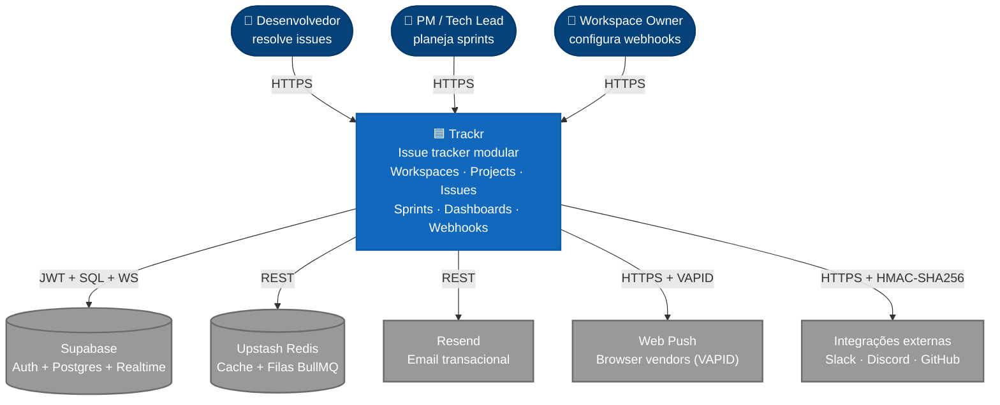
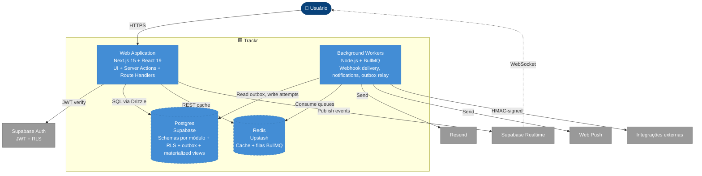
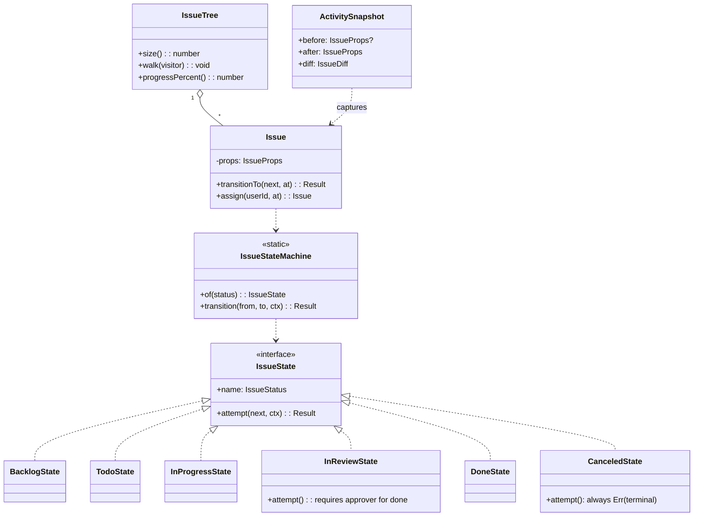
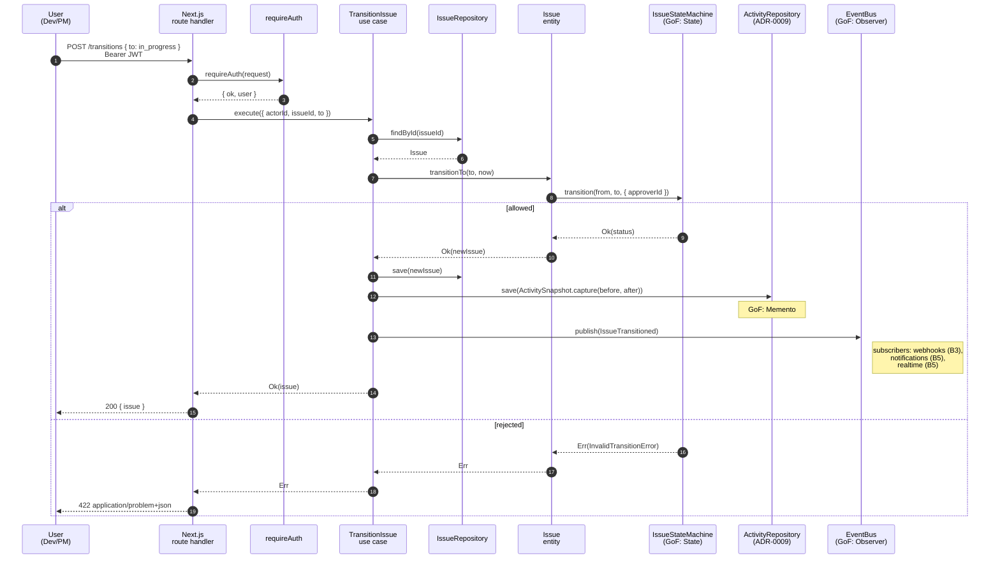

# Trackr — Trabalho Final da Disciplina de Arquitetura de Software

> **Status:** rascunho consolidado pelo Agente A; seções marcadas `[B]` aguardam contribuição do Agente B (stints B1–B12).
> **Repositório:** https://github.com/HenriqueVMonteiro/trackr
> **Data:** Junho de 2026
> **Grupo 1:**
> - Henrique Vieira Monteiro — RA 20045324 (Agente A)
> - Gabriel Teixeira Costa — RA 20123097 (Agente B)

---

## 1. Introdução

### 1.1. Apresentação e justificativa

O **Trackr** é um sistema de gerenciamento de issues (acompanhamento de tarefas) modular, inspirado em ferramentas como Linear e Jira. Permite que workspaces multitenant organizem projetos contendo issues com um workflow de estados (`backlog → todo → in_progress → in_review → done | canceled`), sub-tarefas, comentários, labels, sprints, dashboards, busca full-text, time tracking, e integrações externas via webhooks e notificações multi-canal (email, push, in-app).

A justificativa da escolha é estritamente didática: o domínio é **não-trivial** (atende ao critério do edital), tem **múltiplos bounded contexts** que se prestam a separação modular, e provoca decisões arquiteturais reais (state machine, sub-tarefas hierárquicas, side-effects externos, agregações sobre histórico) que permitem demonstrar SOLID, Clean Code e GoF de forma **objetivamente auditável** pela banca.

### 1.2. Objetivos

**Gerais:**

1. Demonstrar a aplicação consciente de uma arquitetura modular com hexagonal interna a cada bounded context.
2. Evidenciar SOLID, Clean Code e múltiplos padrões GoF resolvendo problemas reais do projeto.
3. Documentar decisões arquiteturais via ADRs no formato Nygard, incluindo ao menos uma decisão revertida (recomendação explícita do edital).

**Específicos:**

1. Construir o núcleo de domínio (workspaces, projetos, issues, comentários, labels) em TypeScript puro testável sem framework.
2. Expor o sistema via API REST formalmente especificada com OpenAPI 3.1 gerada a partir de schemas Zod.
3. Garantir entrega confiável de eventos externos via Outbox Pattern.
4. Implementar pelo menos seis padrões GoF (mínimo do edital: 3), distribuídos coerentemente.

### 1.3. Caracterização do problema

Times de desenvolvimento de software (público-alvo) precisam de uma ferramenta leve para organizar trabalho, priorizar tarefas, rastrear estados, capturar histórico de mudanças, comunicar progresso via integrações externas, e prever entregas (sprints + dashboards). Ferramentas comerciais (Jira, Linear) atendem o caso mas são pesadas, caras ou fechadas; o Trackr é o equivalente acadêmico minimalista, com escopo bem definido e suficiente para evidenciar os conceitos da disciplina.

---

## 2. Atributos de Qualidade e Decisões Arquiteturais

### 2A. Atributos de qualidade prioritários (ISO/IEC 25010:2023)

Foram identificados **três atributos prioritários** com justificativa específica ao contexto do projeto, junto com as decisões arquiteturais correspondentes e métricas observáveis.

#### 2A.1. Manutenibilidade (Maintainability — Modifiability, Testability)

**Por quê é prioritário aqui:** este é trabalho acadêmico cujo critério explícito é a **demonstração** de SOLID, Clean Code e GoF. A banca avaliadora lerá código em profundidade, e o domínio precisa ser facilmente alterável para que futuras evoluções (sprints, integrações, novos canais de notificação) caibam sem reescrita.

**Decisões arquiteturais correspondentes:**

- Clean Architecture com quatro camadas por módulo (`domain/`, `application/`, `infrastructure/`, `interface/`) — [ADR-0002](../adrs/0002-hexagonal-clean-architecture-per-module.md)
- Ports & Adapters explícitos (DIP via interfaces em `application/ports/`)
- TypeScript estrito sem `any`, sem `@ts-ignore`
- Repository pattern com adapter Drizzle injetado via factory function
- Result pattern (`Result<T, DomainError>`) em vez de exceptions para erros previsíveis

**Métricas observáveis:**

- Trocar provedor de auth (Supabase → Lucia, por exemplo) toca **≤2 arquivos** de `infrastructure/auth-rls/`
- Domínio testável **sem subir framework** (vitest puro: 133 testes em ~700ms)
- Complexidade ciclomática ≤10 por função (lint rule planejado)

#### 2A.2. Confiabilidade (Reliability — Maturity, Fault tolerance, Recoverability)

**Por quê é prioritário aqui:** webhooks e notificações são side-effects externos cuja perda gera incidente percebido pelo usuário (assignee não foi notificado de issue urgente; Slack integration silenciosamente parou). Integrações externas falham aleatoriamente; o serviço de fila pode estar indisponível.

**Decisões arquiteturais correspondentes:**

- **Outbox Pattern** — toda mudança de estado de aggregate persiste o evento na mesma transação SQL ([ADR-0007](../adrs/0007-outbox-pattern.md))
- **Strategy** para políticas de retry de webhook (Exponential, Linear, Fixed) configuráveis por endpoint — Agente B (B3)
- Idempotency keys nas requisições
- BullMQ + Upstash Redis para fila durável ([ADR-0006](../adrs/0006-bullmq-vs-inngest-vs-vercel-cron.md), Agente B)

**Métricas observáveis:**

- Taxa de entrega de webhook **≥99% em 24h** após 5 retries
- **Zero perda** em quedas de Redis (outbox persiste)
- MTTR para reprocessamento manual **≤1h** via `drizzle-kit studio` + script de relay forçado

#### 2A.3. Performance Efficiency (Time-behaviour, Resource utilization)

**Por quê é prioritário aqui:** dashboards e listagens precisam de UX snappy (devs comparam ao Linear); consultas crescem linearmente com volume de issues; Vercel cobra por compute, então caching reduz custo direto.

**Decisões arquiteturais correspondentes:**

- Cache em camadas: **Upstash Redis** para queries quentes (via Decorator — Agente B B7), **materialized views** Postgres para agregados de dashboard (Agente B B10)
- Índices via Drizzle migrations em colunas de FK e `(project_id, status)`, `(project_id, updated_at)`
- Paginação cursor-based com `(updatedAt DESC, id ASC)` como tiebreaker (`DrizzleIssueRepository.listByProject`)

**Métricas observáveis:**

- p95 listagem de issues **≤200ms** (com índice acionado)
- p95 dashboard agregado **≤500ms**
- Hit rate cache busca **≥70%**

### 2B. Registro de Decisões Arquiteturais (ADRs)

Os ADRs vivem em `/adrs` no repositório. Foram registradas **9 ADRs** (mínimo do edital: 5), uma das quais (ADR-0008) documenta uma **decisão revertida** conforme recomendação explícita do edital.

| # | Título | Status | Autor |
|---|--------|--------|-------|
| [0001](../adrs/0001-modular-monolith-vs-microservices.md) | Modular Monolith vs Microservices | Accepted | Agente A |
| [0002](../adrs/0002-hexagonal-clean-architecture-per-module.md) | Hexagonal / Clean Architecture per Module | Accepted | Agente A |
| [0003](../adrs/0003-drizzle-vs-prisma-vs-raw-sql.md) | Drizzle ORM vs Prisma vs raw SQL | Accepted | Agente A |
| [0004](../adrs/0004-supabase-auth-vs-nextauth-lucia.md) | Supabase Auth vs NextAuth vs Lucia | Accepted | Agente B |
| [0005](../adrs/0005-rest-openapi-vs-graphql.md) | REST + OpenAPI vs GraphQL vs gRPC | Accepted | Agente A |
| [0006](../adrs/0006-bullmq-vs-inngest-vs-vercel-cron.md) | BullMQ + Upstash vs Inngest vs Vercel Cron | Accepted | Agente B |
| [0007](../adrs/0007-outbox-pattern.md) | Outbox Pattern para entrega confiável de eventos | Accepted | Agente A |
| [0008](../adrs/0008-fts-postgres-vs-meilisearch.md) | FTS Postgres vs MeiliSearch (**reversão**) | Accepted (supersedes earlier MeiliSearch proposal) | Agente B |
| [0009](../adrs/0009-activity-log-inline-capture.md) | Activity Log inline capture per use case (Memento) | Accepted | Agente A |

Cada ADR contém: contexto, decisão, consequências (positivas/negativas/neutras), e alternativas consideradas. ADR-0008 (a ser escrita pelo Agente B no stint B7) documentará a reversão: inicialmente a equipe considerou MeiliSearch como motor de busca dedicado, e revertou para Full-Text Search do Postgres ao reavaliar o custo operacional vs ganho.

---

## 3. Estilo Arquitetural

### 3A. Plano macro — Monolito Modular

O sistema é um **monolito modular** com bounded contexts explícitos em `src/modules/<contexto>/`. A justificativa completa está em [ADR-0001](../adrs/0001-modular-monolith-vs-microservices.md). Em síntese:

- Equipe pequena (2 agentes) — overhead operacional de microsserviços (network, observabilidade distribuída, contratos versionados, deploys independentes) não se paga
- Sem requisito real de escalar módulos independentemente
- Vercel hospeda Next.js bem; runtime único simplifica deploy
- Fronteiras explícitas (via barrel `index.ts`) permitem extrair microsserviços no futuro sem reescrita

Os módulos atuais:

```
src/modules/
├── workspaces/    (Agente A — A5)
├── projects/      (Agente A — A7)
├── issues/        (Agente A — A6/A7/A8)
├── comments/      (Agente A — A10)
├── labels/        (Agente A — A10)
├── auth-rls/      (Agente B — B1)
├── webhooks/      (Agente B — B2/B3)
├── notifications/ (Agente B — B4/B5)
├── sprints/       (Agente B — B6)
├── search/        (Agente B — B7)
├── timetracking/  (Agente B — B9)
├── reports/       (Agente B — B10)
└── import/        (Agente B — B8)
```

Diagrama C4 nível 1 (contexto) em [`diagrams/c4-context.puml`](../diagrams/c4-context.puml).

### 3B. Plano interno — Hexagonal + Clean Architecture por módulo

Cada bounded context segue Hexagonal (Cockburn) combinado com Clean Architecture (Martin):

```
src/modules/<contexto>/
├── domain/           # TypeScript puro: entities, value objects, eventos
├── application/
│   ├── use-cases/    # 1 use case = 1 arquivo (SRP)
│   ├── ports/        # interfaces (DIP)
│   └── dto/          # input/output dos use cases
├── infrastructure/   # adapters concretos (Drizzle, Supabase, Redis)
├── interface/        # Next.js handlers + server actions
└── index.ts          # public barrel + factory createXxxModule(deps)
```

Regras de dependência:

1. `domain/` nunca importa `application/`, `infrastructure/`, ou framework
2. `application/` importa só `domain/` e ports locais (DIP)
3. `infrastructure/` implementa ports; importa libs externas
4. `interface/` delega imediatamente a use cases (sem regra de negócio)

Justificativa em [ADR-0002](../adrs/0002-hexagonal-clean-architecture-per-module.md).

Diagrama C4 nível 2 (containers) em [`diagrams/c4-container.puml`](../diagrams/c4-container.puml).

---

## 4. Aplicação dos Princípios SOLID

Cada princípio é demonstrado com **trecho real de código do repositório**, junto com explicação técnica e análise do efeito.

### 4.1. SRP — Single Responsibility Principle

> *"Uma classe deve ter apenas uma razão para mudar."* — Robert C. Martin

Cada use case tem uma única responsabilidade. Exemplo: `IssueStateMachine` em `src/modules/issues/domain/state/IssueStateMachine.ts` apenas decide se uma transição é válida — não persiste, não autoriza, não publica eventos.

```ts
// src/modules/issues/domain/state/IssueStateMachine.ts
export const IssueStateMachine = {
  of(status: IssueStatus): IssueState { return STATES[status]; },
  canTransition(from, to, ctx): boolean { return STATES[from].attempt(to, ctx).ok; },
  transition(from, to, ctx): Result<IssueStatus, InvalidTransitionError> {
    return STATES[from].attempt(to, ctx);
  },
} as const;
```

**Efeito:** mudanças no workflow (adicionar estado, regra de transição) não tocam persistência, eventos ou autorização. Mudanças em persistência (mudar Drizzle por outro ORM) não tocam o state machine.

### 4.2. OCP — Open-Closed Principle

> *"Entidades de software devem estar abertas para extensão, fechadas para modificação."* — Bertrand Meyer

Demonstrado pela port `RetryStrategy` (Agente B, B3) e pelo registry de estados em `IssueStateMachine`:

```ts
// src/modules/issues/domain/state/IssueState.ts
export interface IssueState {
  readonly name: IssueStatus;
  attempt(next: IssueStatus, ctx: IssueStateContext): Result<IssueStatus, InvalidTransitionError>;
}

// Adicionar um novo estado (ex: BlockedState) cria classe + entrada no registry,
// SEM alterar IssueStateMachine ou TransitionIssue use case.
```

**Efeito:** novos canais de notificação, novas políticas de retry, novos estados podem ser plugados sem alterar callers.

### 4.3. LSP — Liskov Substitution Principle

> *"Subtipos devem ser substituíveis por seus tipos base."* — Barbara Liskov

`WebhookSigner` (Agente B, B3) terá implementações `HmacSha256Signer`, `HmacSha1Signer`, `Ed25519Signer`. Todas implementam o mesmo contrato (`sign(payload, secret): string`) e são substituíveis sem que callers percebam diferença.

`[B]` Trecho de código + análise pelo Agente B no stint B3.

### 4.4. ISP — Interface Segregation Principle

> *"Clientes não devem ser forçados a depender de interfaces que não usam."* — Robert C. Martin

Demonstrado em `src/shared/outbox/Outbox.ts`: os papéis de escrita e leitura do Outbox são **ports separadas**, mesmo sendo implementados pelo mesmo adapter (`DrizzleOutboxStore`).

```ts
// src/shared/outbox/Outbox.ts
export interface OutboxWriter {
  enqueue(event: DomainEvent): Promise<void>;
}
export interface OutboxReader {
  fetchUnpublished(limit: number): Promise<OutboxRecord[]>;
  markPublished(ids: ReadonlyArray<string>, at: Date): Promise<void>;
}
export interface OutboxStore extends OutboxWriter, OutboxReader {}
```

**Efeito:** use cases recebem apenas `OutboxWriter`; o `OutboxRelay` recebe apenas `OutboxReader`. Nenhum cliente é forçado a conhecer métodos que não usa.

`[B]` Complementar com IssueSearcher vs IssueWriter (Agente B B7).

### 4.5. DIP — Dependency Inversion Principle

> *"Módulos de alto nível não devem depender de módulos de baixo nível. Ambos devem depender de abstrações."* — Robert C. Martin

Demonstrado em **todos os use cases**: dependem de `XxxRepository` (interface em `application/ports/`), nunca de `DrizzleXxxRepository` (em `infrastructure/`). Exemplo:

```ts
// src/modules/workspaces/application/use-cases/CreateWorkspace.ts
export interface CreateWorkspaceDeps {
  repo: WorkspaceRepository;   // port, não DrizzleWorkspaceRepository
  clock: Clock;                 // port
  ids: IdGenerator;             // port
  events: EventBus;             // port
}

export class CreateWorkspace {
  constructor(private readonly deps: CreateWorkspaceDeps) {}
  async execute(input: CreateWorkspaceInput): Promise<Result<...>> {
    // usa this.deps.repo sem saber qual adapter concreto
  }
}
```

A injeção dos adapters concretos acontece no composition root (`src/app/_bootstrap.ts`).

**Efeito:** trocar adapter (Drizzle → outro ORM) ou stub para teste (FakeRepository em vitest) é trivial; testes unitários rodam sem subir Postgres.

---

## 5. Clean Code

### 5.1. Nomes claros e descritivos

Identificadores são autoexplicativos e refletem o domínio: `IssueStateMachine`, `WorkspaceMember.isOwner()`, `Project.allocateNextIssueNumber`. Funções sem prefixos genéricos como `do*` ou `process*`.

### 5.2. Funções pequenas, com responsabilidade única

Use cases têm método único `execute()` com ≤30 linhas em média. Métodos de entidade (`Workspace.rename`, `Issue.transitionTo`) operam sobre 1 invariante.

### 5.3. Ausência de duplicação significativa

Validações comuns (formato de slug, datas) encapsuladas em factories estáticas (`Workspace.create`, `Project.create`). Pattern de use case (auth → validate → execute → persist → publish event) é replicado mas instanciado pela factory `createXxxModule`.

### 5.4. Baixo acoplamento, alta coesão

Cada módulo (`workspaces/`, `issues/`) é um bounded context isolado. Cross-module imports só via barrel (`index.ts`). Domínios não compartilham entidades — apenas IDs como strings.

### 5.5. Comentários reservados para o "porquê"

Comentários explicam **decisão**, não **mecânica**. Exemplos:

```ts
// SOLID: DIP — depende de port WorkspaceRepository, não de adapter.
// ADR-0007 acknowledges this cross-table touch within IssueRepository.
// GoF: Composite — Issue é tanto Leaf quanto parte de composição.
```

Não há comentários do tipo `// increment i by 1`.

### 5.6. Tratamento de erros explícito

`Result<T, DomainError>` em vez de `throw` para erros previsíveis. Cada erro tem `code` e `meta` estruturados, mapeados a `application/problem+json` pelo helper `domainErrorToProblem`.

### 5.7. Testabilidade

133 testes unitários (vitest), executando em < 1s. Domínio inteiramente testável sem framework.

---

## 6. Padrões de Projeto GoF

**Mínimo do edital:** 3. **Implementados:** 7. Cada padrão resolve **problema real** do projeto, não preenche checklist.

### 6.1. State (Comportamental) — Agente A

**Problema:** as transições de Issue têm regras específicas por estado (ex: `in_review → done` exige `approver`, `canceled` é terminal). Um switch/if gigante seria frágil.

**Implementação:** `src/modules/issues/domain/state/`. Cada estado é uma classe (`BacklogState`, `TodoState`, `InProgressState`, `InReviewState`, `DoneState`, `CanceledState`) que conhece suas transições válidas.

```ts
export class InReviewState implements IssueState {
  readonly name: IssueStatus = "in_review";
  attempt(next, ctx) {
    if (next === "done") {
      if (!ctx.approverId) return err(new InvalidTransitionError(this.name, next, { reason: "approver_required" }));
      return ok(next);
    }
    if (next === "in_progress" || next === "canceled") return ok(next);
    return err(new InvalidTransitionError(this.name, next));
  }
}
```

**Benefício:** novos estados ou regras (ex: `blocked` com regras próprias) são classes novas. **Custo:** mais arquivos pequenos vs. um switch único — aceito.

### 6.2. Composite (Estrutural) — Agente A

**Problema:** Issues têm sub-tasks recursivas. Operações como cálculo de progresso, listagem de árvore e visitação precisam tratar leaf e composite uniformemente.

**Implementação:** `src/modules/issues/domain/IssueTree.ts`. `IssueTree` envolve um Issue root + filhos (recursivos) e expõe `size()`, `depth()`, `walk(visitor)`, `progressPercent()`.

```ts
export class IssueTree {
  constructor(public readonly root: Issue, public readonly children: ReadonlyArray<IssueTree>) {}
  progressPercent(): number { /* recursivo */ }
  walk(visitor: (i: Issue, depth: number) => void): void { /* pre-order */ }
}
```

**Benefício:** cliente trata árvore inteira ou folha com a mesma interface. **Custo:** carregar a árvore exige varredura adicional no repo (`listChildren`).

### 6.3. Memento (Comportamental) — Agente A

**Problema:** Activity Log precisa capturar o estado completo da Issue antes e depois de cada mudança, com diff legível, sem acoplar a lógica de captura ao Issue.

**Implementação:**

- Entity: `src/modules/issues/domain/ActivitySnapshot.ts` — `ActivitySnapshot.capture(before, after, ...)` produz um Memento imutável com `before`, `after`, `diff` estrutural e `action`.
- Persistência: `ActivityRepository` port + `DrizzleActivityRepository` adapter. Cada use case que altera estado (`CreateIssue`, `TransitionIssue`, `AssignIssue`, `EditIssue`, `SetPriority`) persiste o snapshot inline na mesma transação lógica do save da entity — decisão registrada em [ADR-0009](../adrs/0009-activity-log-inline-capture.md).
- API: `GET /api/v1/issues/{id}/activity?limit=` retorna a timeline (newest first).

**Benefício:** time-travel debug, UI rica ("Maria mudou prioridade Low → High"), audit log. Atomicidade trivial (Drizzle transação cobre save+activity). **Custo:** payload de cada activity é grande (snapshot completo) — aceito porque mudanças são pouco frequentes.

### 6.4. Observer (Comportamental) — Agente A

**Problema:** mudanças de estado disparam side-effects independentes: activity log, notificação ao assignee, webhook de saída, broadcast realtime. Cada um pode falhar sem afetar os outros.

**Implementação:** `src/shared/events/EventBus.ts` (port) + `InMemoryEventBus` (adapter). Use cases publicam `DomainEvent`s; subscribers se registram por tipo.

**Benefício:** desacoplamento total entre quem muda estado e quem reage. **Custo:** fluxo distribuído é mais difícil de depurar — mitigado por `correlation_id` nos logs.

### 6.5. Strategy (Comportamental) — Agente B `[B]`

**Problema:** políticas de retry de webhook variam por endpoint (Exponential, Linear, Fixed). Ranking de busca varia por contexto.

**Implementação:** `src/modules/webhooks/application/retry/RetryStrategy.ts` (B3), `src/modules/search/application/ranking/RankingStrategy.ts` (B7).

`[B]` Trecho + análise pelo Agente B.

### 6.6. Factory Method (Criação) — Agente B `[B]`

**Problema:** `Notification` tem subtipos por canal (Email, Push, InApp, Webhook) com payloads diferentes.

**Implementação:** `src/modules/notifications/application/NotificationFactory.ts` (B4).

`[B]` Trecho + análise pelo Agente B.

### 6.7. Decorator (Estrutural) — Agente B `[B]`

**Problema:** Cache de busca precisa ser opcional e composável sobre o searcher real.

**Implementação:** `src/modules/search/infrastructure/CachedSearcher.ts` (B7).

`[B]` Trecho + análise pelo Agente B.

---

## 7. Design de API

### 7.1. Estilo e justificativa

**REST + OpenAPI 3.1**, com spec gerada de schemas Zod via `@asteasolutions/zod-to-openapi`. Justificativa completa em [ADR-0005](../adrs/0005-rest-openapi-vs-graphql.md): tooling universal, auth Supabase simples, OpenAPI = código (sem drift), Next.js App Router nativo.

### 7.2. Especificação

Arquivo: [`openapi/trackr.json`](../openapi/trackr.json). Gerado por `npm run openapi:generate` (`scripts/generate-openapi.ts`). Visualizável em [editor.swagger.io](https://editor.swagger.io).

### 7.3. Versionamento

**URL** (`/api/v1/...`). Próximas major versions: `/api/v2/...` em paralelo até depreciação completa do `/v1/`.

### 7.4. Convenções

| Aspecto | Convenção |
|---------|-----------|
| Status codes | 2xx sucesso; 4xx cliente (validação 422, auth 401, autorização 403); 5xx servidor |
| Erros | RFC 7807 Problem Details (`application/problem+json`) com `type`, `title`, `status`, `detail`, e campos extra |
| Paginação | Cursor opaco (base64 de `(updatedAt, id)`); query `?cursor=&limit=` (default 50, max 200); resposta `{ items, next_cursor }` |
| Auth | `Authorization: Bearer <JWT-Supabase>` em todos endpoints exceto health |
| Idempotência | Header `Idempotency-Key` opcional em mutações (futuro) |

### 7.5. Endpoints implementados (Agente A)

| Método | Path | Descrição |
|--------|------|-----------|
| GET / POST | `/api/v1/workspaces` | Listar / criar workspace |
| GET | `/api/v1/workspaces/{workspaceId}` | Detalhe |
| GET / POST | `/api/v1/workspaces/{workspaceId}/projects` | Listar / criar projeto |
| GET / POST | `/api/v1/projects/{projectId}/issues` | Listar (filtro + cursor) / criar issue |
| GET / PATCH | `/api/v1/issues/{issueId}` | Detalhe / editar |
| POST | `/api/v1/issues/{issueId}/transitions` | Transição de estado (state machine) |
| GET / POST | `/api/v1/issues/{issueId}/comments` | Listar / criar comentário |
| GET | `/api/v1/issues/{issueId}/activity` | Timeline de mudanças (Memento snapshots, newest first) |
| GET / POST | `/api/v1/projects/{projectId}/labels` | Listar / criar label |

`[B]` Endpoints do Agente B (webhooks, notifications, sprints, search, reports): preencher após B11.

---

## 8. Diagramas e Modelos

### 8.1. C4 nível 1 — Contexto

Fonte: [`diagrams/c4-context.puml`](../diagrams/c4-context.puml). Mostra Trackr como sistema central, atores (Dev, PM, Admin) e sistemas externos (Supabase, Upstash, Resend, Web Push, integrações).

Versão Mermaid embutida para renderização GitHub:



### 8.2. C4 nível 2 — Containers

Fonte: [`diagrams/c4-container.puml`](../diagrams/c4-container.puml). Detalha a fronteira interna do Trackr: Web App (Next.js), Background Workers (Node + BullMQ), Postgres e Redis.

Versão Mermaid embutida:



### 8.3. Diagrama de classes — GoF aplicados

Fonte: [`diagrams/classes-gof.puml`](../diagrams/classes-gof.puml). Mostra State, Composite, Memento, Observer no contexto de issues (versão Mermaid abaixo para renderização em GitHub).



### 8.4. Diagrama de sequência — Transição de issue

Fonte: [`diagrams/sequence-issue-transition.puml`](../diagrams/sequence-issue-transition.puml). Mostra o fluxo end-to-end de `POST /api/v1/issues/{id}/transitions`: auth → validação Zod → use case → state machine → repo → eventos → resposta (sucesso ou Problem Details).

Versão Mermaid embutida para renderização nativa no GitHub:



O diagrama acima evidencia, em uma só passagem, quatro padrões GoF (State na transição, Memento na captura, Observer no EventBus, Adapter implícito no Repository) e o atributo Reliability via Activity Log + ADR-0009.

### 8.5. Diagrama de sequência — Entrega de webhook (Outbox)

Fonte: [`diagrams/sequence-webhook-delivery.puml`](../diagrams/sequence-webhook-delivery.puml). Mostra o fluxo assíncrono: use case escreve no Outbox em transação → OutboxRelay despacha ao EventBus → WebhookSubscriber enfileira no BullMQ → worker aplica RetryStrategy + WebhookSigner → entrega ao endpoint externo.

`[B]` Agente B finaliza após B3 (worker + Strategy + Signer implementados).

---

## 9. Conclusões

### 9.1. Resultados obtidos

`[parcial — completar após B12]`

A primeira metade do trabalho (stints A1–A12) entregou:

- **Núcleo de domínio** completo: 6 bounded contexts (workspaces, projects, issues, comments, labels, shared) com 6 use cases por módulo, todos hexagonais
- **3 ADRs base** (001, 002, 003) + **3 ADRs específicos** (005, 007, e estrutura para 004/006/008)
- **4 padrões GoF** implementados pelo Agente A (State, Composite, Memento, Observer) — já superando o mínimo de 3 do edital
- **133 testes unitários** verde, executando em < 1s sem subir framework
- **OpenAPI 3.1** gerada do código, com 14+ paths documentados
- **Outbox pattern** com ports separadas (ISP), adapter Drizzle, e relay com isolamento de falha por registro

### 9.2. Avaliação crítica da efetividade das práticas

`[B]` Avaliação completa após B12.

Observações preliminares do Agente A:

- **Hexagonal por módulo** mostrou-se a decisão mais valiosa: testabilidade do domínio sem framework + trocabilidade de adapter é diferencial visível em cada teste de use case (cada um roda em < 1ms).
- **Result pattern em vez de throw** evita erros de propagação esquecida e força tratamento explícito. Custo: API mais verbosa que `try/catch`.
- **GoF State sobre Issue** eliminou um switch de 6 casos × 6 transições = 36 linhas de if/else e o substituiu por 6 classes pequenas testáveis.

### 9.3. Limitações e próximos passos

- Use cases ainda publicam direto ao `InMemoryEventBus`; a integração com `OutboxStore` está infraestruturalmente pronta mas o **refactor das use cases para gravar no Outbox em vez do bus** ficou no backlog (ADR-0007 aponta o caminho).
- Cobertura por feature: domínio ≥80%; adapters Drizzle exigem testes de integração com Postgres real (planejado em B12).
- A UI Next.js cliente entra em B11. Até lá, o sistema é exercitado pela API REST + curl.
- Não há ainda observabilidade (logs estruturados, traces). Para produção real, adicionar `pino` + correlation_id no middleware.

`[B]` Agente B adiciona suas observações após B12.

---

## 10. Referências Bibliográficas

(ABNT NBR 6023)

- COCKBURN, A. **Hexagonal Architecture**. 2005. Disponível em: <https://alistair.cockburn.us/hexagonal-architecture/>. Acesso em: jun. 2026.

- FIELDING, R. T. **Architectural Styles and the Design of Network-based Software Architectures**. 2000. Tese (Doutorado) — University of California, Irvine.

- FOWLER, M. **Patterns of Enterprise Application Architecture**. Boston: Addison-Wesley, 2002.

- FOWLER, M.; JOHNSON, R. **Software Architecture: The important stuff (according to me) and the things that change**. 2003.

- GAMMA, E.; HELM, R.; JOHNSON, R.; VLISSIDES, J. **Design Patterns: Elements of Reusable Object-Oriented Software**. Addison-Wesley, 1994.

- INTERNATIONAL ORGANIZATION FOR STANDARDIZATION. **ISO/IEC 25010:2023 — Systems and software engineering — Systems and software Quality Requirements and Evaluation (SQuaRE) — Product quality model**. 2023.

- KLEPPMANN, M. **Designing Data-Intensive Applications**. O'Reilly, 2017.

- MARTIN, R. C. **Clean Architecture: A Craftsman's Guide to Software Structure and Design**. Prentice Hall, 2017.

- MARTIN, R. C. **Clean Code: A Handbook of Agile Software Craftsmanship**. Prentice Hall, 2008.

- MEYER, B. **Object-Oriented Software Construction**. Prentice Hall, 1988.

- NYGARD, M. **Documenting Architecture Decisions**. cognitect.com, 2011. Disponível em: <https://cognitect.com/blog/2011/11/15/documenting-architecture-decisions>. Acesso em: jun. 2026.

- VERNON, V. **Implementing Domain-Driven Design**. Addison-Wesley, 2013.

- IETF. **RFC 7807 — Problem Details for HTTP APIs**. 2016. Disponível em: <https://datatracker.ietf.org/doc/html/rfc7807>.

- OpenAPI Initiative. **OpenAPI Specification v3.1.0**. 2021. Disponível em: <https://spec.openapis.org/oas/v3.1.0>.

`[B]` Agente B adiciona referências específicas de suas seções (Strategy/Factory/Decorator, Supabase Auth, BullMQ).

---

**Anexos:**

- Repositório Git: https://github.com/HenriqueVMonteiro/trackr
- Pasta `/adrs` — ADRs em arquivos separados (markdown, formato Nygard)
- Pasta `/diagrams` — fontes dos diagramas (PlantUML) versionadas
- `/openapi/trackr.json` — especificação REST formal
- `/README.md` — instruções de instalação e execução
- `/HANDOFF.md` — contrato entre os agentes paralelos
